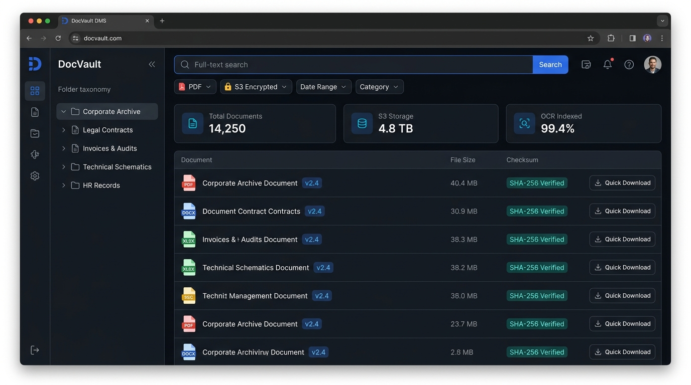

# DocVault DMS — Document & Archive Management System


DocVault DMS is an enterprise document indexing, storage, and retrieval platform. It integrates Amazon S3 / MinIO object storage with PostgreSQL tsvector full-text search (GIN indexed) to enable rapid document lookups and cryptographically secure presigned download links.



---

## 🏛️ System Architecture

```
                       +---------------------------------------+
                       |           Web SPA Client              |
                       |    (React / Search & View Engine)     |
                       +-------------------+-------------------+
                                           |
                                           v
+------------------------------------------------------------------------------------+
|                         DocVault Express API Gateway                               |
|                                                                                    |
|   +--------------------------------------+-------------------------------------+   |
|   |          Auth & Permission Check     |       SHA-256 Hash Validator        |   |
|   +--------------------------------------+-------------------------------------+   |
|                                          |                                         |
|                 +------------------------+------------------------+                |
|                 |                                                 |                |
|                 v                                                 v                |
|  +------------------------------+                +------------------------------+  |
|  |    MinIO / S3 Object Layer   |                |   PostgreSQL Full-Text Search|  |
|  |  (Presigned URL Generator)   |                |   (GIN Index on tsvector)    |  |
|  +--------------+---------------+                +--------------+---------------+  |
+-----------------|-------------------------------------------------|----------------+
                  |                                                 |
                  v                                                 v
    +---------------------------+                     +---------------------------+
    | Object Storage Bucket     |                     | Relational Metadata Table |
    | (docvault-archive)        |                     | (documents)               |
    +---------------------------+                     +---------------------------+
```

---

## 🚀 Key Features

- **S3 Presigned URLs**: Direct time-bounded download authorization links that protect storage credentials while offloading bandwidth from API nodes.
- **PostgreSQL GIN Full-Text Indexing**: Sub-10ms full-text keyword indexing across millions of document bodies.
- **Cryptographic Integrity Check**: SHA-256 hash calculated at ingest time to guarantee file immutability.
- **Containerized Stack**: Includes MinIO S3 cluster and PostgreSQL ready for one-command Docker launch.

---

## 🔌 API Endpoints

### Full-Text Search
```http
GET /api/v1/documents/search?q=quarterly+audit&category=FINANCE
```

### Presigned Download
```http
GET /api/v1/documents/{id}/download-link
```

---

## 💻 Local Setup

```bash
git clone https://github.com/kubrvk/DocVault-DMS.git
cd DocVault-DMS

docker compose up -d --build
```

---

## 👤 Author & License

- **Author**: `kubrvk` ([GitHub Profile](https://github.com/kubrvk))
- **License**: MIT License.
