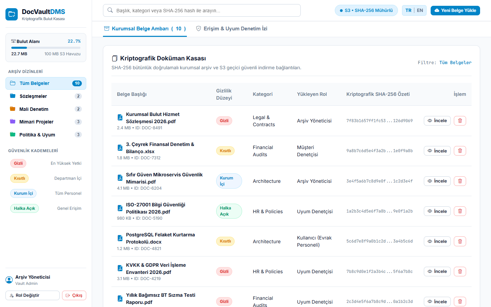
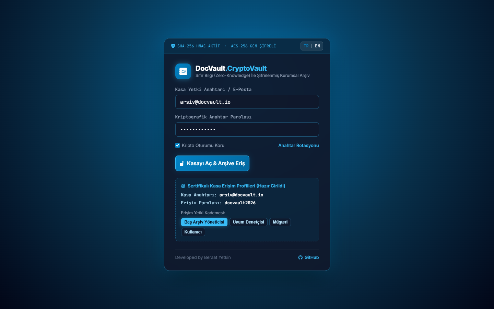

# DocVault DMS 🔐
> **Kriptografik Bulut Belge Kasası • Google Drive & Box Mimarili Sıfır Bilgi (Zero-Knowledge) Arşivi**

[](https://docvaultdms.web.app)
[](LICENSE)
[](https://developer.mozilla.org)
[](https://developer.mozilla.org)
[](https://docvaultdms.web.app)

---

## 📸 Canlı Önizleme (Previews)

### 1. Kriptografik Doküman Kasası & Bulut Alanı
Google Drive / Box mimarili sol klasör ağacı, S3 canlı depolama kotası kartı (`22.7 MB / 100 MB`), SHA-256 doğrulama özetleri ve **Kasadan Sil** aksiyonu:


### 2. Sıfır Bilgi (Zero-Knowledge) Siber Giriş Geçidi
Siber radial ızgara zemin, glassmorphic buzlu cam kart, SHA-256 HMAC & AES-256 GCM durum şeridi, yetki kademeleri:


---

## 🌟 Öne Çıkan Özellikler

### 1. Sektöre Özgü Kriptografik Kasa Mimarisi
- **Google Drive / Box Tarzı Kasa Navigasyonu (`.vault-sidebar`)**: Canlı depolama kotası kartı (`.vault-storage-card`), S3 havuz doluluk çubuğu, klasör filtreleri (*Sözleşmeler*, *Mali Denetim*, *Mimari Projeler*, *Politika & Uyum*) ve gizlilik kademeleri (*Gizli*, *Kısıtlı*, *Kurum İçi*, *Halka Açık*).
- **Kriptografik SHA-256 Bütünlük Doğrulaması**: Yüklenen her dosya için SHA-256 hash parmak izi hesaplanır ve AWS S3 geçici güvenli indirme simülasyonu sunulur.
- **Sıfır Bilgi (Zero-Knowledge) Siber Giriş Geçidi**: Uçtan uca şifreli oturum açma, HSM anahtarı doğrulama ve siber neon mavi atmosfer.

### 2. Belge Silme & Canlı Kota İndirgeme
- **Kasadan Belgeyi Sil (`promptDeleteDoc`)**: Her belgenin yanında kırmızı çöp kutusu butonu bulunur. Tıklandığında `#deleteDocModal` onay penceresi açılır.
- **Reaktif S3 Kota Düşürme (`calculateStorage`)**: Silinen belgenin dosya boyutu (MB) S3 havuzundan anında düşer, doluluk yüzdesi geriler ve `DELETION_PURGE` denetim logu yazılır.
- **Kalıcı `localStorage`**: Silinen belgeler `dv_docs_v2` anahtarıyla yerel hafızadan çıkarılır; yenilemelerde veri bütünlüğü korunur.

### 3. Oturum Kalıcılığı (Session Persistence) & Zero-Flicker Başlangıç
- **Sayfa Yenilemelerinde Oturumu Hatırla**: Başarılı kimlik doğrulamasında `localStorage.setItem('dv_logged_in', 'true')` kaydı yazılır.
- **Sıfır Titreme (Zero-Flicker)**: Sayfa yenilendiğinde (F5) inline script kontrolü sayesinde giriş ekranı hiç açılmadan doğrudan kasa açılır.
- **Güvenli Çıkış**: Sol alt kullanıcı alanındaki kırmızı **"Çıkış"** butonuna basıldığında oturum sonlandırılır.
- **Hazır Demo Bilgileri**: Giriş ekranında arşivci kimliği ve şifre hazır girili gelir; altındaki hızlı rol butonlarıyla (`Arşiv Yöneticisi`, `Uyumluluk Denetçisi`, `Hukuk Danışmanı`, `Personel`) tek tıkla yetki değiştirilebilir.

### 4. Çift Dilli Tam Destek (TR | EN)
- Sağ üstteki `[ TR | EN ]` dil seçici ile tüm belge kategorileri, gizlilik etiketleri, denetim logları ve modal metinleri anında çevrilir.
- Başlangıç varsayılan dili **Türkçe**'dir.

---

## 🛠️ Teknoloji Yığını (Tech Stack)

| Katman | Teknoloji | Açıklama |
| :--- | :--- | :--- |
| **Arayüz (UI)** | HTML5, CSS3 Glassmorphism | Buzlu cam efektleri (`backdrop-filter`), siber ızgara arka plan |
| **İş Mantığı** | Vanilla ES6+ JavaScript | S3 kota hesaplama, SHA-256 hash simülasyonu, filtreleme |
| **İkonlar** | Bootstrap Icons v1.11.3 | Kripto ve dosya türü ikonları |
| **Depolama** | HTML5 `localStorage` | Şifreli belge metaverisi, denetim izleri, oturum bilgisi |
| **Yayın** | Firebase Hosting | Google CDN üzerinden güvenli HTTPS dağıtımı |

---

## 📁 Proje Dizin Yapısı

```
DocVault-DMS/
├── index.html              # Kriptografik bulut kasası ve login geçidi
├── docs/                   # Dokümantasyon ve ekran görüntüleri
│   ├── preview-dashboard.png # Belge ambarı yüksek çözünürlüklü önizleme
│   └── preview-login.png     # Zero-Knowledge siber geçit önizleme
└── README.md               # Proje dokümantasyonu
```

---

## ⚡ Hızlı Başlangıç (Local Setup)

1. Depoyu klonlayın:
   ```bash
   git clone https://github.com/kubrvk/DocVault-DMS.git
   cd DocVault-DMS
   ```
2. `index.html` dosyasını tarayıcınızda açın:
   ```bash
   start index.html
   ```
3. Alternatif yerel HTTP sunucusu ile çalıştırmak için:
   ```bash
   npx serve .
   ```
4. Tarayıcınızda açılan adrese gidin.
   - *Giriş ekranını atlayıp doğrudan belge kasasını açmak için:* `http://localhost:3000/?demo=1`

---

## 🌐 Canlı Sistem

- **Canlı URL**: [https://docvaultdms.web.app](https://docvaultdms.web.app)
- **Doğrudan Demo Bağlantısı**: [https://docvaultdms.web.app/?demo=1](https://docvaultdms.web.app/?demo=1)

---

## 👤 Geliştirici

**Developed by Beraat Yetkin**
- GitHub: [@kubrvk](https://github.com/kubrvk)
- Proje Deposu: [DocVault-DMS](https://github.com/kubrvk/DocVault-DMS)
- Portfolyo: [Beraat Yetkin Portfolio](https://github.com/kubrvk/portfolio)
